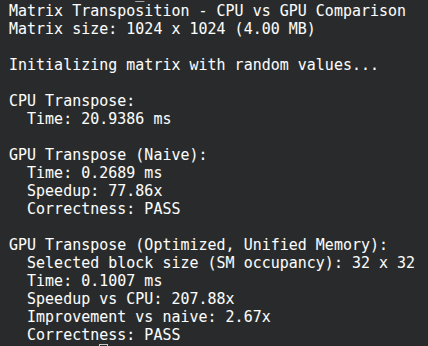
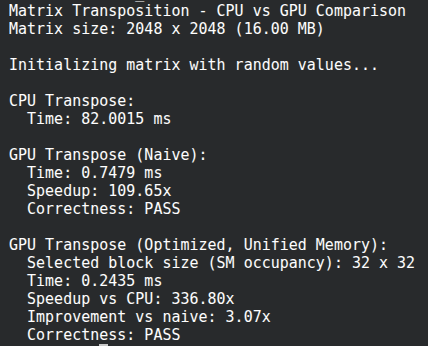
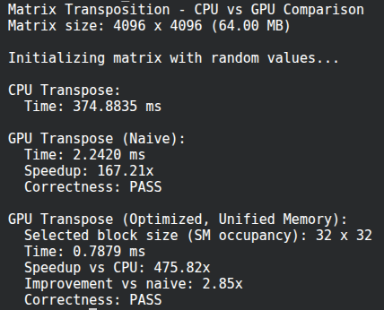
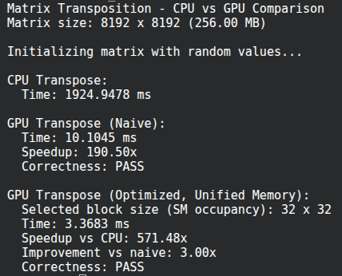

# Matrix Transposition

This project compares CPU and CUDA implementations of matrix transposition.

## Implementations

- CPU transpose as the baseline.
- Naive CUDA transpose using global memory.
- Optimized CUDA transpose using unified memory and shared-memory tiling.
- Correctness verification for every run.
- Execution-time reporting for CPU, naive GPU, and optimized GPU.

## Build and Run

Build the project with CMake and Make. The executable prints the matrix size, timings, speedups, and correctness status for each run.

## Screenshots

### 1024 x 1024

### 2048 x 2048

### 4096 x 4096

### 8192 x 8192

## Measured Results

| Matrix size | CPU time | Naive GPU time | Optimized GPU time | CPU / Naive | CPU / Optimized | Naive / Optimized |
| --- | ---: | ---: | ---: | ---: | ---: | ---: |
| 1024 x 1024 | 20.9386 ms | 0.2689 ms | 0.1007 ms | 77.86x | 207.88x | 2.67x |
| 2048 x 2048 | 82.0015 ms | 0.7479 ms | 0.2435 ms | 109.65x | 336.80x | 3.07x |
| 4096 x 4096 | 374.8835 ms | 2.2420 ms | 0.7879 ms | 167.21x | 475.82x | 2.85x |
| 8192 x 8192 | 1924.9478 ms | 10.1045 ms | 3.3683 ms | 190.50x | 571.48x | 3.00x |

## Report Answers

### 1. Measure and report execution times for all implementations

The table above contains the measured execution times for the CPU baseline, naive GPU implementation, and optimized GPU implementation across four matrix sizes. The optimized version is consistently the fastest GPU path.

### 2. Analyze performance differences and explain the reasons

The CPU version is much slower because it processes the transpose serially and does not benefit from massive data parallelism.

The naive GPU version is much faster than the CPU version because the transpose work is split across many CUDA threads. However, it still uses direct global-memory access patterns that are not ideal for every thread interaction.

The optimized GPU version is faster than the naive one because it uses shared memory to stage tiles of the matrix before writing them back in transposed order. That reduces inefficient global-memory access and improves memory reuse. Unified memory simplifies the memory model, and prefetching reduces page migration overhead before kernel launch.

### 3. Discuss the impact of matrix size on relative performance

As the matrix size grows, the absolute runtime increases for every implementation. The relative CPU-to-GPU speedup also grows, because larger matrices provide more work for the GPU to amortize launch overhead and memory-management costs.

The optimized GPU version keeps a strong advantage across all sizes, and its speedup over the CPU becomes especially large for bigger matrices. The naive GPU version also improves with size, but not as much as the optimized version.

### 4. Identify potential further optimizations

Possible next steps:

- benchmark several block sizes instead of selecting one automatically
- tune block size per device architecture
- use wider vectorized loads/stores where applicable
- improve shared-memory layout further for specific matrix shapes
- add CUDA events around copies and kernels separately for more detailed profiling
- test non-square matrix sizes as an extension

